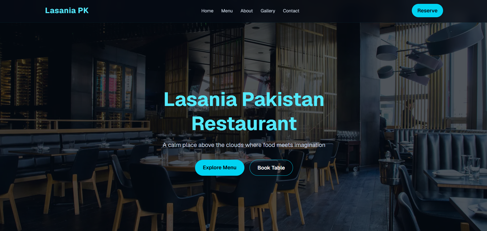
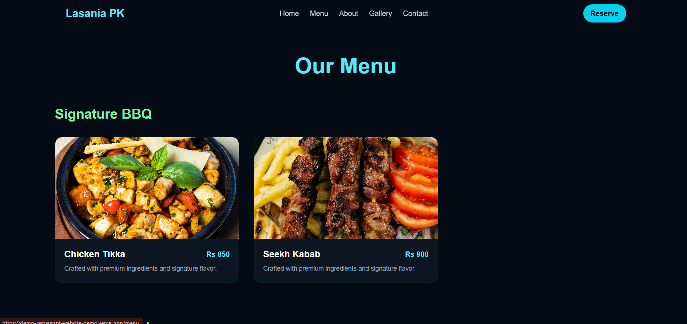
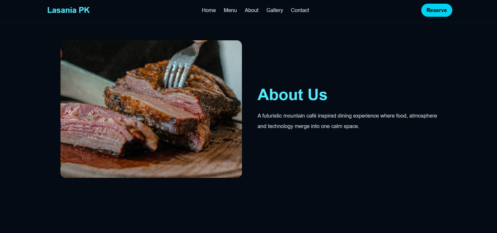
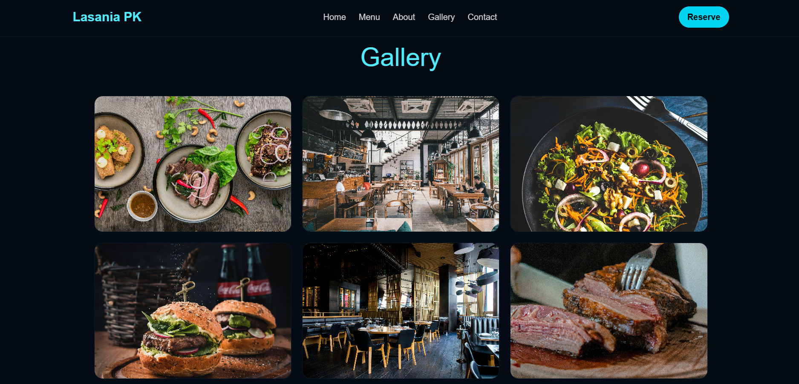
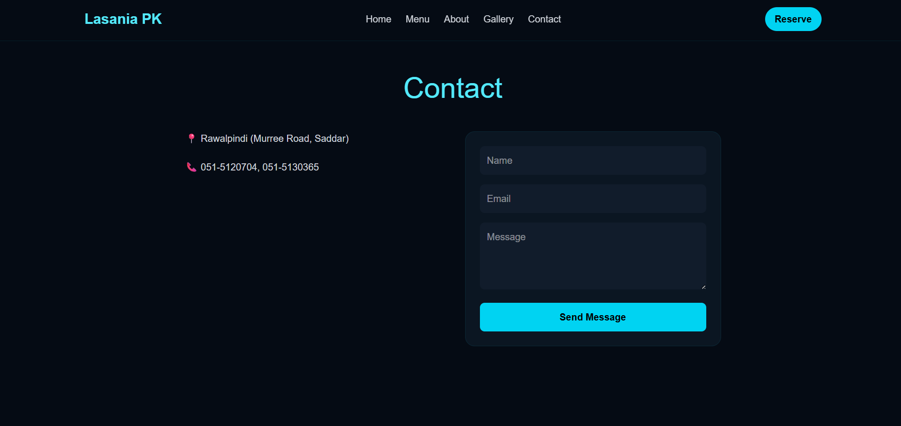
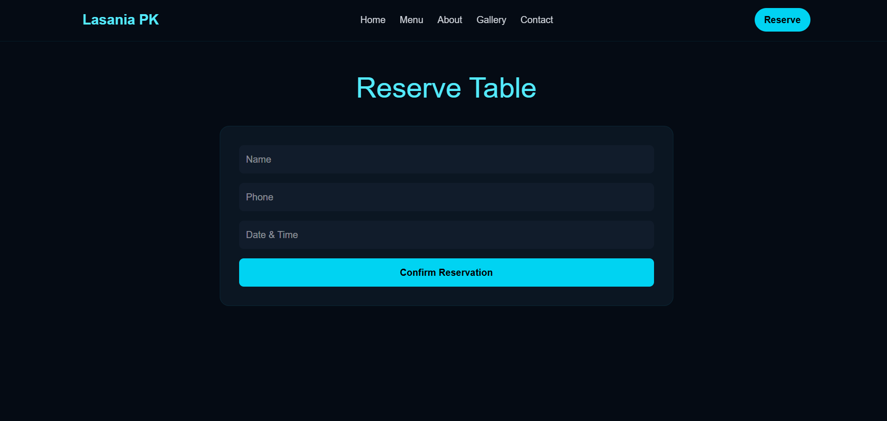

# Lasania Pakistan Restaurant Frontend Demo

Front-end demo for a restaurant website prototype built with Next.js, React, TypeScript and Tailwind CSS. It presents a consistent multi-page restaurant experience with Home, Menu, About, Gallery, Contact and Reservations pages.

## Overview

This repository showcases a rapid frontend prototyping approach for a restaurant-style website. The focus is on layout, visual consistency and responsive presentation rather than backend functionality.

## Live Demo

Live demo: [demo-restaurant-website-demo.vercel.app](https://demo-restaurant-website-demo.vercel.app/)

## Features

- Multi-page public website structure
- Consistent restaurant theme across all pages
- Hero section with prominent call to action
- Menu cards with image-led presentation
- Gallery grid for visual browsing
- Contact and reservation UI pages
- Responsive layout and shared page shell
- Portfolio-ready README screenshots

## Tech Stack

- Next.js
- React
- TypeScript
- Tailwind CSS

## Screenshots

Place exported page screenshots in the [`screenshots`](./screenshots) folder.








## Project Structure

```text
app/
  about/
  contact/
  gallery/
  menu/
  reservations/
  globals.css
  layout.tsx
  page.tsx

components/
  home/
  layout/
    PageHeader.tsx
    PageShell.tsx

screenshots/

src/
  data/
    menu.ts
```

## Learning Focus

- Building a small multi-page frontend from a shared design system
- Structuring a Next.js app for portfolio presentation
- Keeping UI copy and visuals truthful to the implementation
- Improving spacing, alignment and responsive behavior without a full redesign

## Future Improvements

- Add a real booking flow if backend support is introduced
- Replace remote image URLs with project assets
- Add active navigation states and mobile navigation
- Add form validation if the contact and reservation pages become functional